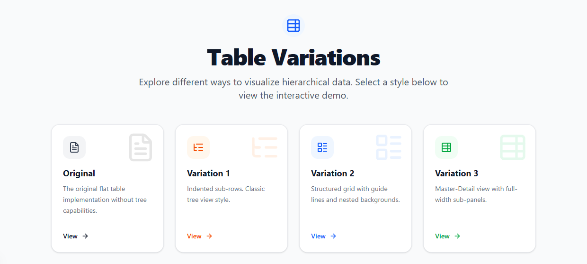
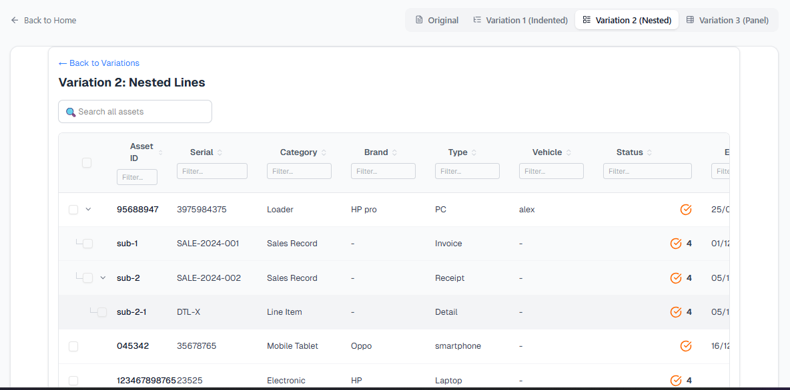

# Asset Management - Advanced Tree Grid Variations

A modern, high-performance Asset Management interface built with **Next.js 14**, **TypeScript**, and **TanStack Table**. This project demonstrates advanced data grid capabilities, specifically focusing on hierarchical (tree) data structures and master-detail views.


*Figure 1: Main Explorer Screen showing options for Original, Variant 1, Variant 2, and Variant 3.*

## 📸 Previews

| Variation 1 (Indented) | Variation 2 (Nested Lines) | Variation 3 (Master-Detail) |
|:---:|:---:|:---:|
|  |  |  |
| *Classic Tree View* | *Visual Guides & Colors* | *Expandable Sub-panels* |

## 🚀 Key Features

### 1. Unified Table Explorer
Seamlessly switch between different table visualizations without refreshing the page. The application maintains state via URL query parameters, making views shareable.

### 2. Three Tree Grid Variations
*   **Variation 1: Indented Tree**
    *   Classic file-system style hierarchy.
    *   Single-column indentation for a clean, familiar look.
*   **Variation 2: Nested Lines**
    *   Visual guide lines (L-shape connectors) tracking parent-child relationships.
    *   Depth-based background coloring for clear visual separation.
*   **Variation 3: Master-Detail Panel**
    *   Full-width expandable sub-panels for detailed sub-item management.
    *   **Interactive Sub-grids**: Directly add and edit sub-items within the panel.

### 3. Advanced Interactions
*   **Inline Editing**: Double-click any cell to edit content (Text, Date, Select).
*   **Drag-and-Drop Columns**: Reorder columns effortlessly using `@dnd-kit`.
*   **Sorting & Filtering**: Built-in multi-column sorting and global search.
*   **Sub-Item Management**: Create new sub-items dynamically in Variation 3.

## 🛠️ Tech Stack

*   **Framework**: [Next.js 14](https://nextjs.org/) (App Router)
*   **Language**: [TypeScript](https://www.typescriptlang.org/)
*   **Styling**: [Tailwind CSS](https://tailwindcss.com/)
*   **UI Components**: [Shadcn UI](https://ui.shadcn.com/) (Radix Primitives)
*   **Table Logic**: [TanStack Table v8](https://tanstack.com/table/v8) (Headless)
*   **Drag & Drop**: [@dnd-kit](https://dndkit.com/)
*   **Icons**: [Lucide React](https://lucide.dev/)

## 📦 Installation

1.  **Clone the repository**:
    ```bash
    git clone https://github.com/your-username/asset-management-tree-grid.git
    cd asset-management-tree-grid
    ```

2.  **Install dependencies**:
    ```bash
    npm install
    # or
    yarn install
    ```

3.  **Run the development server**:
    ```bash
    npm run dev
    ```

4.  **Open your browser**:
    Navigate to [http://localhost:3000](http://localhost:3000).

## 🔧 Usage Guide

*   **Switching Views**: Use the toggle buttons at the top right of the table to switch between Original, V1, V2, and V3.
*   **Adding Sub-items**: Go to **Variation 3**, expand a row, and click the "+ Add subitem" button.
*   **Editing**: Double-click on cells like "Serial", "Category", or "Status" to enter edit mode. Press `Enter` to save or `Esc` to cancel.
*   **Reordering**: Drag column headers to change their arrangement. The order is persisted locally.

## 📄 License

This project is licensed under the MIT License.