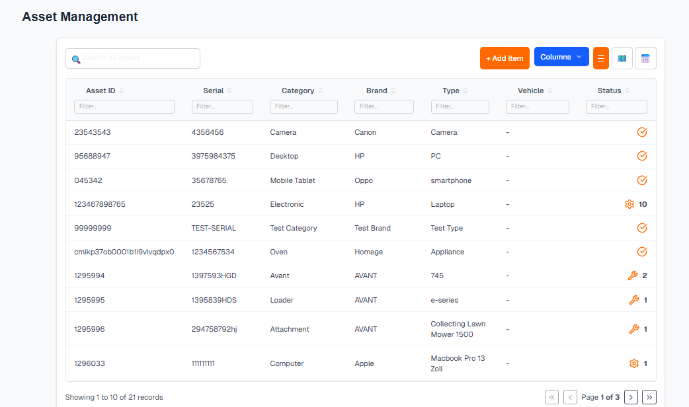

# 🚀 Next.js Enterprise Data Grid Suite

A high-performance, modular Data Grid system built with **Next.js**, **TanStack Table**, and **Tailwind CSS**.

This project demonstrates a modernized, "headless" approach to enterprise data tables. Unlike legacy solutions (e.g., standard AG Grid implementations), this architecture offers 100% UI customizability, superior rendering performance, and a unified API for different business verticals.



## 🌟 Project Overview

This suite combines multiple grid implementations to solve distinct business requirements:

1.  **Asset Management:** A clean, light-mode interface for tracking physical inventory with status indicators and action modules.
2.  **Performance Analytics:** A high-density, dark-mode interface for financial and participant data with grouped headers and complex metrics.

## ⚡ Key Features

Built to satisfy specific enterprise constraints:

* **🔍 Instant Filtering:** Column-specific filters located directly within headers (or below) for rapid data narrowing.
* **👁️ Dynamic Column Visibility:** Users can toggle specific columns on/off via a settings dropdown, preserving layout stability.
* **✏️ Inline Editing:** Double-click interaction model allows users to edit data in place.
    * *Smart inputs:* Text fields for strings, dropdowns for status, and numeric validation.
* **🎨 Multi-Theme Architecture:** seamless support for both Light Mode (Asset View) and Dark Mode (Performance View).
* **Performance:** Optimized for large datasets using virtualization techniques.

## 🛠️ Tech Stack

* **Framework:** Next.js 14 (App Router)
* **Core Logic:** @tanstack/react-table (v8)
* **Styling:** Tailwind CSS + clsx
* **Language:** TypeScript

## 📦 Installation

1.  Clone the repository:
    ```bash
    git clone [https://github.com/YOUR-USERNAME/enterprise-grid-suite.git](https://github.com/YOUR-USERNAME/enterprise-grid-suite.git)
    ```

2.  Install dependencies:
    ```bash
    npm install
    ```

3.  Run the development server:
    ```bash
    npm run dev
    ```

## 💡 Why This Solution?

Client Requirement: *"We are not making grid exactly like ag-grid... we like to have most of the features... can u give a improved better version of this?"*

**The Improvement:**
Standard grids are often "bloated" with unused JavaScript. This solution uses a **Headless UI** pattern. We stripped away the heavy default styles of AG Grid and rebuilt the core features (Filter, Edit, Hide) using TanStack Table. This results in a smaller bundle size, faster "First Contentful Paint," and a UI that perfectly matches the "Quartz" and "Clean" design systems requested.